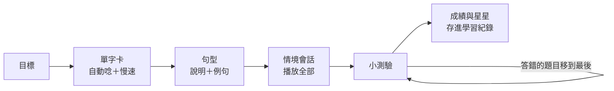

# Ippo 一歩

> 一步一步，開口說日文。給完全新手的手機日文課：從五十音走到簡單會話。

- **對象：** 沒學過日文的台灣人，目標是旅行與日常生活裡的簡單對話。
- **形式：** 手機優先的網頁，打開就能學；不用註冊、不用下載 App，學習紀錄存在自己的瀏覽器。
- **每一課：** 目標 → 單字卡 → 句型與例句 → 情境會話 → 小測驗。每一句日文都能點來聽發音，也能慢速播放。
- **架構：** 純前端靜態網站（Vite + TypeScript + Tailwind CSS），沒有後端、沒有 API 金鑰，GitHub Pages 直接服務。

> 語言：UI 與課程內容為繁體中文（台灣用語）；程式碼與註解為英文。

---

## 課程規劃

7 個單元、17 課。前兩課先把耳朵打開；之後每一課都是「一個情境 ＋ 一到三個句型」，學完就能在那個情境開口。最後一課把前面的句型串成一段完整的飯店入住對話。

| 單元 | 課 | 學完可以… | 核心句型 |
|---|---|---|---|
| 1 發音入門 | 1 日文的聲音 | 唸出五個母音，認得日文的三種文字 | あいうえお、一個假名＝一拍 |
| | 2 長音・促音・拗音 | 聽出一拍的差別，不把「阿姨」叫成「奶奶」 | おばさん／おばあさん、きて／きって |
| 2 打招呼 | 3 打招呼 | 早上、白天、晚上都能打招呼與道別 | おはよう ございます、こんにちは、こんばんは |
| | 4 謝謝與不好意思 | 道謝、道歉，也會回應別人 | すみません 的三種用法、はい／いいえ |
| | 5 自我介紹 | 說出名字、從哪裡來、做什麼 | A は B です、〇〇 から きました |
| 3 認識彼此 | 6 是…嗎？ | 用「か」發問，用はい／いいえ回答 | A は B です か、じゃ ありません |
| | 7 這是什麼？ | 指著東西問「這是什麼」、說「誰的」 | これ／それ／あれ、A の B |
| | 8 數字 1～100 | 聽懂與說出數字、交換電話號碼 | じゅう いち、に じゅう、ひゃく |
| 4 購物 | 9 這個多少錢？ | 問價錢、請店員拿給你看、買下來 | いくら です か、〇〇 を ください |
| | 10 在便利商店 | 聽懂店員問袋子、加熱、筷子並回答 | 〇〇 は いります か、〇〇 で おねがい します |
| 5 餐廳 | 11 點餐 | 說人數、點餐、點數量 | 〇〇 を ひとつ ください、〇〇 に します |
| | 12 好吃！結帳 | 用餐前後的招呼、稱讚、分開結帳 | とても おいしい です、べつべつ で |
| 6 交通 | 13 〇〇在哪裡？ | 問路，聽懂右邊、左邊、直走 | 〇〇 は どこ です か、ここ／そこ／あそこ |
| | 14 搭電車 | 問票價、找月台、確認列車有沒有停 | 〇〇 に いきたい です、〇〇 に とまります か |
| 7 生活會話 | 15 現在幾點？ | 問時間，聽懂營業時間 | なんじ です か、〇じ から 〇じ まで |
| | 16 喜歡什麼？ | 聊喜歡的食物與興趣 | 〇〇 が すき です、あまり すき じゃ ありません |
| | 17 飯店入住（總複習） | 獨立完成入住、問早餐時間 | 串起前面學過的句型 |

### 一課怎麼走



- **一次一張卡：** 底部大按鈕「繼續」，單手就能操作；隨時可以回上一步。
- **先聽再看：** 卡片出現時自動唸一次（可關閉），每張單字卡都有慢速播放；會話可以一次播完整段，並隱藏中文自我測驗。
- **測驗：** 自動出題（看日文選意思、聽音選字、看中文選日文）加上每課手寫的題目（情境選句、助詞填空、聽力、句子重組），最後用會話裡你的台詞「說說看」。測驗裡還會穿插前面學過、該複習的內容，新舊交錯著考。答錯的題目會在最後再出一次，全部答對才算完成；分數是「一次就答對」的比例。
- **單元挑戰：** 每個單元的課後面都有一個「單元挑戰」：把整個單元混在一起考——聽對方的台詞、說自己的台詞、句子重組與單字輪流出現，約 12 題。隨時可以挑戰，成績會留下最佳星等。
- **每日複習：** 學過的單字、例句、會話台詞都會變成卡片，用 FSRS（Anki 的排程演算法）安排複習：答對隔越久才出現，答錯很快再見面。題目隨熟悉度從「認得」→「聽懂」→「說出來」。「練習」分頁顯示今天的份量與成效：連續學習天數、記住的單字、說得出口的句子、隔幾天還記得的比例。
- **新手友善：** 漢字一律標讀音，每句附羅馬拼音與中文（熟悉後可在設定關掉）；單字之間留空格方便斷詞；「五十音」分頁點了就唸，也有小測驗。

## 發音

使用瀏覽器內建的 [Web Speech API](https://developer.mozilla.org/docs/Web/API/SpeechSynthesis)，不需要音檔，也不需要任何金鑰。

- 聲音來自裝置本身：iPhone／Mac 是 Kyoko、Otoya 等，Android 是 Google 語音，Windows 是 Haruka、Nanami。預設自動挑音質較好的日文語音，設定頁可以自己選、調語速。
- 裝置沒有日文語音時，設定頁會顯示安裝方式（iOS、Android、Windows）。
- 語音引擎讀的是**漢字原文**而不是假名，所以內容必須是自然的日文；讀音容易被唸錯的字（例如單獨的「何」）改用假名或整句。

## 內容怎麼寫

每一課是一個檔案：`src/content/lessons/NN-id.ts`，在 `src/content/course.ts` 依序登記。型別定義在 `src/content/types.ts`，可以參考 `05-self-intro.ts`。

日文用一種很小的標記語法，一個字串同時產生：振假名顯示、語音朗讀的文字、羅馬拼音、句子重組題的字卡。

```ts
"{私|わたし} は {台湾|たいわん} から {来|き}ました。"
// 顯示：私(わたし) は 台湾(たいわん) から 来(き)ました。
// 朗讀：私は台湾から来ました。
// 拼音：watashi wa taiwan kara kimashita.
// 字卡：私 / は / 台湾 / から / 来ました
```

- 單字之間用一個半形空格分開；助詞（は が を に で へ と も の から まで）、句尾的 か ね よ、です 都是獨立的字。
- 漢字一律寫成 `{漢字|かな}`；送假名放在括號外（`{行|い}きます`）。數字、英文字母也要放進括號：`{300円|さんびゃくえん}`。
- 當助詞的 は／へ 必須自成一個字，羅馬拼音才會是 wa／e；こんにちは、こんばんは 例外處理。
- 填空題在句子裡放一個 `＿`。

`npm test` 會檢查整個課程：每個漢字都有讀音、助詞有分開、選項不重複、選擇題只有一個正確答案、句子重組至少三個字等。

## 開發

需要 Node.js 20.19+、22.12+ 或 24+。

```bash
npm install
npm run dev      # http://localhost:5173
npm test         # 單元測試 + 課程內容檢查
npm run build    # 型別檢查 + 打包到 dist/
```

```
src/
  content/   課程內容（lessons/）、五十音表、型別、內容檢查
  learn/     卡片、FSRS 排程、記憶狀態與成效指標
  lib/       日文標記解析、羅馬拼音、語音、localStorage
  quiz/      出題與「答錯重來」的測驗流程
  ui/        畫面：課程地圖、上課、測驗、五十音、設定
tests/       單元測試與內容檢查
```

程式怎麼分層、新增課程／題型／頁面／設定／儲存資料各要改哪裡，見 [`docs/architecture.md`](docs/architecture.md)。Pull request 會自動跑測試與建置。

## 部署

推到 `main` 後，GitHub Actions（`.github/workflows/pages.yml`）會跑測試、打包並部署到 GitHub Pages。第一次使用請到 repo 的 **Settings → Pages → Source** 選 **GitHub Actions**。路由全部走網址的 `#`，所以放在任何子路徑都能運作。

支援 iOS Safari 17.4+、Android Chrome 119+ 與目前的桌面瀏覽器。

## License

MIT
